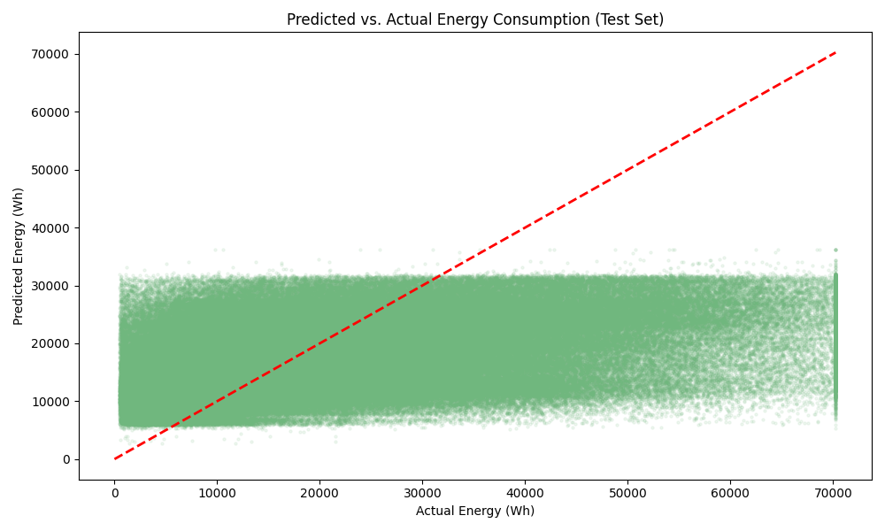

# Project Milestone: EV Charger Energy Consumption Prediction Model

## 1. Executive Summary for Non-Technical Audiences

I have built a machine learning model that predicts how much energy an EV will consume during a charging session. This model "learns" from past behavior at each station, considering the time of day and historical trends. 

**Limitation:** The current model lacks individual user behavior data, which is essential for higher precision. This session-level anonymity means the model captures location-based trends but cannot account for specific vehicle/user preferences.

### Key Predictors of Energy Demand
The model identifies several critical factors that influence how much energy is consumed:

*   **Station Baseline (Primary Driver)**: The strongest predictor of energy use is the historical average demand for each specific station, split into **Daytime (4 AM – 8 PM)** and **Nighttime (8 PM – 4 AM)** shifts. By learning these "baselines," the model captures the unique usage profile of every location.
*   **Charger Power Class**: The type of equipment significantly determines energy output. We categorize chargers into four groups: *AC Standard, DC Fast, HPC (High Power),* and *Ultra Fast*. Notably, an **Ultra-Fast** charger requires, on average, **10 kWh more energy per session** than an **AC-Standard** station.
*   **Hourly Cycles**: The specific **hour of the day** is used to refine predictions and anticipate peak usage windows throughout the 24-hour cycle.
*   **Historical Trends**: While the model also monitors recent history (such as the average of the last 5 sessions or the past week’s usage), these factors are secondary to the station’s long-term day/night profile.

**Current Performance & Future Outlook**
The current model successfully identifies these primary drivers and provides directional insights. However, individual sessions can still be highly variable. This is primarily because the dataset contains **no individual user or vehicle identifiers**, meaning we cannot account for specific driver behaviors. In future iterations, expanding the dataset with opt-in user metrics would further refine the model's precision.

For a detailed ranking of what drives these predictions, see **Visualization 2.1 (Feature Importance)** below.

## 2. Key Visualizations & Insights

### Visualization 2.1: Feature Importance

*Insight: Historical station averages and time-indexed features are the strongest drivers of energy consumption, highlighting that charging behavior is highly dependent on location and shift timing.*

#### 2.2 Predicted vs. Actual

*Insight: The model shows a clear positive correlation between predicted and actual values. But as you see after 35 Wh of actual energy consumption, the model is not explaining the variance of the data well. 

## 3. How This Model Could Be Used

*   **Energy Auditors**: Use the model to benchmark station efficiency and identify outliers that consume more power than predicted.
*   **Grid Management Systems**: Integrate the model into real-time dashboards to forecast upcoming peaks based on scheduled or anticipated morning/evening charging waves.
*   **Implementation Strategy**: Deploy as a lightweight API service that building management systems can query to estimate local transformer load.

## 4. Limitations, Fairness & Ethical Considerations

### 4.1. Current Limitations & Model Accuracy
While the model identifies key directional trends, its predictive power for individual sessions is currently limited, explaining approximately 10% of the variance in the data. This "performance gap" is a direct result of the **anonymized nature of the OBELIS dataset**, which lacks specific user metrics. Most predictions currently fall within a range of 8 to 30 kWh, as you can see in Visualization 2.2 (Predicted vs. Actual).

### 4.2. Cold-start problem
Performance may be lower for stations in newly developed areas with little history (the "cold-start" problem). 

### 4.3. Ethical Considerations
The model is designed for energy prediction. But through bad performance, this model should not be used to predict energy consumption for individual sessions. Because this could lead to service disruptions.

