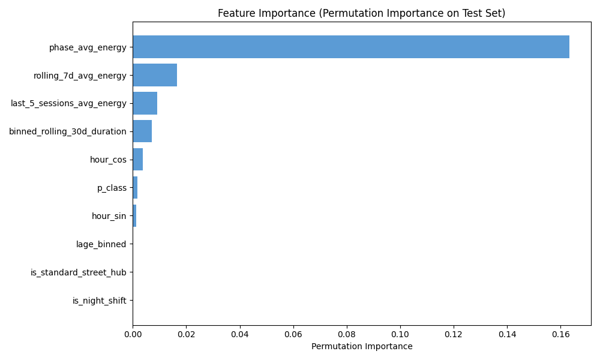

### Tomorrow University
# ML-Regression Project: EV Charging Energy Demand Prediction

This project leverages machine learning to predict the energy consumption (`energie_wh`) of individual electric vehicle (EV) charging sessions. This predictive capability empowers **EV Charging Providers** and **Grid Operators** to:

1.  **Optimize Grid Load Management**: Anticipate and balance energy demand to prevent local infrastructure overloads.
2.  **Enable Dynamic Pricing**: Implement variable pricing strategies (e.g., Time-of-Use pricing) based on predicted session requirements to incentivize sustainable charging behavior. 

> Sadly the prediction of the model is not explaining the variance of the data well. So in the future I would need more specific user behaviour data to improve the model, to be useful for Stakeholders.

## Data

The dataset used in this project is the **OBELIS Dataset (2018-2024)**, which contains master and operating data of publicly accessible charging stations for electric vehicles.

- **Scale**: 29,222,434 rows and 10 features.
- **Time Range**: 2018 → 2024.
- **Source**: [Mobilithek - OBELIS Dataset](https://mobilithek.info/offers/714073450865197056)
- **License**: [Creative Commons Attribution 4.0 International (CC BY 4.0)](https://creativecommons.org/licenses/by/4.0/)
- **Attribution**: 
  > "OBELISöffentlich: Stamm- und Betriebsdaten geförderter öffentlich zugänglicher Ladestationen für Elektrofahrzeuge" / NOW GmbH (Nationale Leitstelle Ladeinfrastruktur) (2025) unter der Lizenz CC BY 4.0

## 📂 Project Structure: Where to find what

- **`data/`**: Contains the dataset at various stages.
  - `raw/`: Original, immutable data.
  - `interim/`: Intermediate transformed data. In Yearly Brackets of the 1M rows Subset
- **`notebooks/`**: Jupyter notebooks for each stage of the project.
  - `00_data_loadandsplit.ipynb`: Initial data loading and train/test splitting. Into Yearly Splits from 2018-2024.
  - `01_cleancleanereda.ipynb`: Data cleaning and Exploratory Data Analysis.
  - `02_model_choice.ipynb`: Model selection, tuning (Ridge vs. HGBR), and comparison.
  - `summary.md`: Detailed synthesis of technical findings and stakeholder value.
- **`src/`**: Source code for data transformation.
  - `pipeline_feature_engineering.py`: Core logic for feature engineering (lag features, cyclic encoding, etc.).
- **`output/`**: Visualizations generated during the analysis (feature importance, prediction plots).

## 📊 Key Results

The project evaluated several models, ultimately selecting the **Tuned Histogram Gradient Boosting Regressor (HGBR)** for its performance in capturing complex session dynamics.

### Model Performance (Final HGBR):
- **RMSE**: 15,808 Wh (v.s. ~18,473 Wh for the naive baseline)
- **MAE**: 11,641 Wh
- **R²**: 0.0932

*Note: While the R² indicates high session-to-session variability, the model provides a significant improvement over baseline predictions for aggregate grid planning.*

### EDA-Insights:
* Target Variable `energie_wh` is Heavy right-skew: mean (20,785 Wh) ≈ 2× median (15,335 Wh); max reaches ~99k Wh
* Hourly Patterns only accur for AC_Standard Chargers (maximaleladeleistung <22kwh)
* Highest Correlation with target variable is `phase_avg_energy`  0.446

### Best Performing Features HGBR Model:

### Insights:
- **Historical Trends**: Station-specific historical averages (`phase_avg_energy`) are the strongest predictors.
- **Temporal Patterns**: Charging behavior is dependent on the time of day and station type. However, without **individual user data**, the model's ability to differentiate between "opportunistic" and "essential" charging remains limited.
